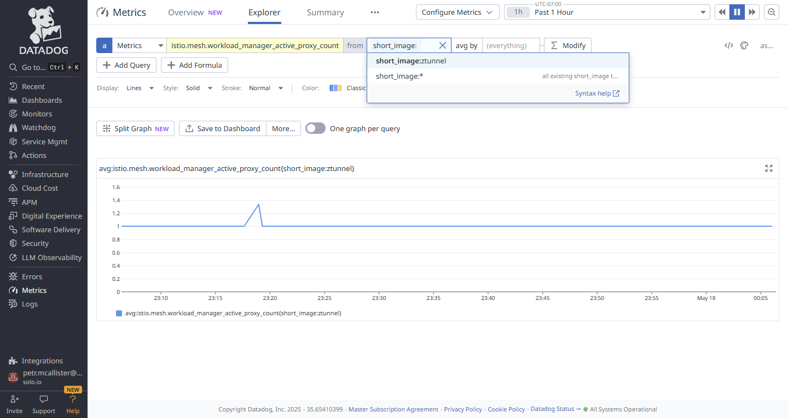

# Datadog Agent adjustments for Istio Ambient

Datadog natively integrates with Istio. When running Istio in Ambient mode, the metrics are exposed via `ztunnel` container as there is no `istio-proxy` sidecars. This guide shows how to add ztunnel metrics to Datadog default configuration. Adding metrics to the default integration allows to avoid additional costs in Datadog pricing as the metrics that are custom are billed at higher rate.

## Prerequisites

- Kubernetes cluster with Istio 1.25 (Solo.io distribution) deployed in Ambent mode
- if using Helm, Datadog API key set as `HELM_KEY` environment variable

## Check what metrics are available in ztunnel

first confirm that the metrics are enabled in ztunnel.

```bash
$ istioctl ztunnel-config all -ojson | jq .config.l7Config
{
  "access_log": {
    "enabled": true,
    "skip_connection_log": false
  },
  "enabled": true,
  "metrics": {
    "enabled": true
  },
  "tracing": {
    "enabled": true,
    "otlp_endpoint": "http://opentelemetry-collector.istio-system:4317"
  }
}
```

then get the metrics list from ztunnel.

```bash
kubectl debug -n istio-system \
  --image=nicolaka/netshoot \
  --target=istio-proxy \
  -it $(kubectl get pod -n istio-system -l app=ztunnel -o jsonpath='{.items[0].metadata.name}') \
  -- bash -c "curl -s http://localhost:15020/metrics | grep -E '^(istio|workload_manager)_' | cut -d '{' -f 1 | awk '{print \$1}' | sort -u"
```

the output list the metrics that are available in ztunnel.

```output
<...>
Defaulting debug container name to debugger-vsqzx.
istio_build
istio_xds_connection_terminations_total
istio_xds_message_bytes_total
istio_xds_message_total
workload_manager_active_proxy_count
workload_manager_pending_proxy_count
workload_manager_proxies_started_total
workload_manager_proxies_stopped_total
```

## Install

There are two options add valuess directly to the deployment or update the default values via `ConfigMap`.

### Option 1: Add values directly via install:

you can use the following values.yaml to install or upgrade Datadog Agent with the metrics enabled. (please note that HELM_KEY value is required even if you have installed the agent already)

```bash
helm upgrade -i --create-namespace --namespace datadog datadog-agent datadog/datadog \
  --set datadog.apiKey=$HELM_KEY \
  -f helm/values.yaml
```

### Option 2: Override values via `ConfigMap`:

create `ConfigMap` using prepared yaml:

```bash
kubectl create ns datadog
kubectl apply -n datadog -f configmap/cm-override.yaml
```

instruct Datadog deployment to use the ConfigMapL

```bash
helm upgrade -i --create-namespace --namespace datadog datadog-agent datadog/datadog \
  --set datadog.apiKey=$HELM_KEY \
  -f configmap/values.yaml
```


## Validate Installation

after the installation, you can check the pods are running and the metrics are available.

```bash
  $ kubectl get pods -n datadog
NAME                                          READY   STATUS    RESTARTS   AGE
datadog-agent-cluster-agent-5b8746994-wwvt4   1/1     Running   0          93s
datadog-agent-p9n64                           2/2     Running   0          93s
datadog-agent-t9szm                           2/2     Running   0          93s
```

then confirm that ztunnel is added to the configuration.

```bash
$ kubectl exec -n datadog -it $(kubectl get pod -n datadog -l app=datadog-agent -o jsonpath='{.items[0].metadata.name}') -c agent -- agent configcheck \ 
| sed -n '/short_image:ztunnel/,/^===/p'
  - short_image:ztunnel
use_openmetrics: true
~
Auto-discovery IDs:
* proxyv2
* proxyv2-rhel8
* ztunnel
===
```

Lastly go to Datadog dashboard and check the metrics are available.

you can go to Datadog UI select Metrics Explorer (https://app.datadoghq.com/metric/explorer) and type one of the metrics. In the screenshot the `istio.mesh.workload_manager_active_proxy_count` and you can see the ztunnel image is available as the input source.



# ecosystem-guides
